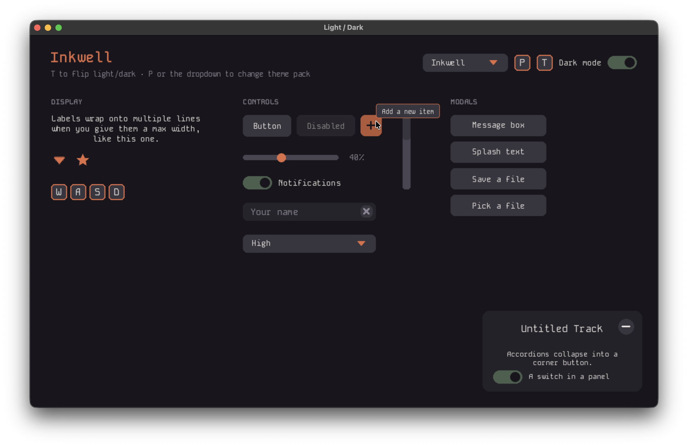
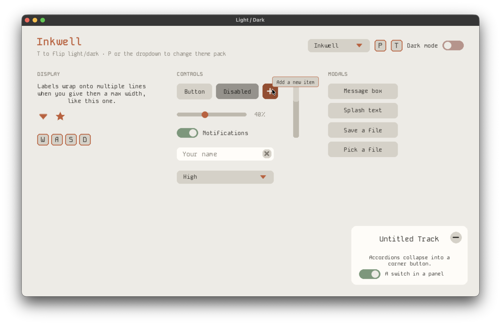

# Pygame UI

<p align="center">
  
  
</p>

## Contents

- [Getting Started](#getting-started) — [Installation](#installation) · [Quick start](#quick-start)
- [Core Concepts](#core-concepts) — [Element API](#element-api) · [Building layouts](#building-layouts) · [Positioning: offset + stick](#positioning-offset--stick) · [Auto-sizing](#auto-sizing) · [Common constructor parameters](#common-constructor-parameters)
- [Styling & Theming](#styling--theming) — [Themes](#themes) · [Instance styling](#instance-styling) · [Subtree themes](#subtree-themes) · [Styles every element understands](#styles-every-element-understands)
- [Elements](#elements)
  - [Layout](#layout) — [Layer](#layer) · [Container](#container) · [Column](#column) · [Row](#row) · [Accordion](#accordion)
  - [Display](#display) — [Label](#label) · [Image](#image) · [InlineSVG](#inlinesvg) · [KeyIcon](#keyicon) · [Hover hints](#hover-hints)
  - [Controls](#controls) — [Button](#button) · [TextButton](#textbutton) · [ImageButton](#imagebutton) · [Slider](#slider) · [Switch](#switch) · [TextInput](#textinput) · [Dropdown](#dropdown) · [ScrollBar](#scrollbar)
  - [Modals](#modals) — [Message](#message) · [LabelModal](#labelmodal) · [FileSaver](#filesaver) · [FilePicker](#filepicker) · [ModalElement](#modalelement)
- [Focus & input flow](#focus--input-flow)
- [Writing your own element](#writing-your-own-element)
- [Debugging](#debugging)

A UI library for [pygame](https://pyga.me/) that gives you buttons, sliders, text inputs, dropdowns, modals and more, with a CSS-like theming system, automatic layout containers, and focus/hover/cursor handling built in. It integrates into your existing game loop in three lines: create a `UI`, feed it events, draw it.

---

## Getting Started

### Installation

Requires **Python ≥ 3.10** and **pygame-ce**. The library isn't on PyPI yet, install from source:

```bash
git clone <this-repo>
cd pygame-ui
pip install -e .        # or: uv add --editable .
```

### Quick start

```python
import pygame
from pygame_ui import *

pygame.init()
screen = pygame.display.set_mode((1280, 720), pygame.RESIZABLE, vsync=1)
clock = pygame.time.Clock()

# --- UI setup ---
ui = UI(screen)
layer = Layer(ui)

Label(layer, "Hello world", (30, 30), "nw")
TextButton(layer, "Click me", (30, 70), (200, 50), "nw",
           action=lambda: print("clicked"))

# --- Game loop ---
running = True
while running:
    screen.fill((15, 15, 15))

    events = pygame.event.get()
    unconsumed_events = ui.handle_events(events)   # give the UI first refusal on input

    for event in unconsumed_events:
        if event.type == pygame.QUIT:
            running = False
        if event.type == pygame.WINDOWRESIZED:
            ui.on_resize()

    ui.draw()                  # update + draw everything

    pygame.display.flip()
    clock.tick()

pygame.quit()
```

Three calls, every frame: `ui.handle_events(events)` before your own event handling (it hands back whatever nothing in the UI used, so your game logic only sees leftover events — a click that hit a button doesn't also reach your game); `ui.draw()` after your own drawing; and `ui.on_resize()` whenever you get a `pygame.WINDOWRESIZED` event, so elements reposition themselves.

---

## Core Concepts

### Element API

Every element in the library is an `Element` underneath, and inherits everything below. Elements just add their own constructor parameters and styles on top.

#### Lifecycle hooks

Called automatically every frame. Only relevant if you're [subclassing](#writing-your-own-element) — the base implementations are no-ops (`draw` just draws children):

| Hook                           | Called                                                                                                        |
|--------------------------------|---------------------------------------------------------------------------------------------------------------|
| `update()`                     | every frame, even while hidden                                                                                |
| `visible_update()`             | every frame, only while visible and enabled                                                                   |
| `draw(surface)`                | every frame while visible; call `self.draw_children(surface)` at the end                                      |
| `on_press()`                   | mouse button pressed down on this element                                                                     |
| `on_release()`                 | mouse button released while this element was the one held down                                                |
| `on_click()`                   | press and release both landed on this element (a full click)                                                  |
| `handle_mouse_event(event)`    | used to handle other mouse events (other than the ones above); return `True` to consume it                    |
| `handle_keyboard_event(event)` | when a keyboard event reaches the focused element (or bubbles up to an ancestor); return `True` to consume it |
| `on_screen_resize()`           | window resized                                                                                                |

#### Visibility & state

| Method                   | Description                                                             |
|--------------------------|-------------------------------------------------------------------------|
| `set_show(value)`        | Show or hide the element                                                |
| `set_disabled(disabled)` | Enable/disable the element and all its descendants                      |
| `remove()`               | Detach the element from the UI                                          |
| `bring_to_front()`       | Move the element above its siblings                                     |
| `is_selected()`          | Whether the element currently holds focus                               |
| `is_held_down()`         | Whether the primary mouse button is currently held down on this element |
| `get_hover_hint()`       | The tooltip text set via `hover_hint=`, if any                          |

#### Position & size

| Method                 | Description                                                                                         |
|------------------------|-----------------------------------------------------------------------------------------------------|
| `get_pos()`            | Screen position `(x, y)`, computed from offset + stick                                              |
| `get_size()`           | Current `(width, height)`                                                                           |
| `set_dimensions(w, h)` | Resize the element (either axis may be `None` on elements that support [auto-sizing](#auto-sizing)) |
| `width` / `height`     | Properties equivalent to `get_size()[0]` / `[1]`; assigning calls `set_dimensions`                  |
| `under_mouse()`        | Whether the cursor is currently over the element's bounds                                           |

#### Styling

| Method                                     | Description                                                                            |
|--------------------------------------------|----------------------------------------------------------------------------------------|
| `style` (property)                         | The element's fully resolved style dictionary                                          |
| `update_styling(rules)`                    | Merge new `{property: value}` rules into this element's instance styling               |
| `update_styling_property(prop, value)`     | Change one style property                                                              |
| `update_subtree_theme(rules, cls=Element)` | Add theme rules that apply to every descendant — see [Subtree themes](#subtree-themes) |
| `get_cursor()`                             | The resolved `cursor` style — what the mouse cursor shows while hovering this element  |

---

### Building layouts

Start every screen with a `Layer(ui)` — a screen-filling surface you add elements to. Use several to organise your app (menu layer, HUD layer, pause layer, …) and show/hide them with `set_show`.

Every element takes the thing it lives inside as its first constructor argument, and appears the moment you construct it — no separate "add" step:

```python
layer = Layer(ui)
panel = Accordion(layer, "Settings", (30, 30), stick="se")
Switch(panel, (20, 60), "nw")
```

Group several elements under one parent with `with`, instead of repeating it on every line:

```python
with Row(layer, spacing=12, stick="ne") as top_right:
    Dropdown(top_right, ["Easy", "Normal", "Hard"], stick="ns", dimensions=(160, 34))
    Switch(top_right, stick="ns")
```

### Positioning: offset + stick

Elements are positioned relative to their parent with an `offset = (x, y)` and a `stick` string made of the characters `n`, `e`, `s`, `w` (north/east/south/west). The stick decides which side of the parent the offset is measured from:

| Stick (per axis) | Meaning                                             |
|------------------|-----------------------------------------------------|
| `w` (or none)    | offset measured from the parent's **left** edge     |
| `e`              | offset measured from the parent's **right** edge    |
| `e` + `w`        | **horizontally centred**, offset shifts from centre |
| `n` (or none)    | offset measured from the parent's **top** edge      |
| `s`              | offset measured from the parent's **bottom** edge   |
| `n` + `s`        | **vertically centred**, offset shifts from centre   |

So `"nw"` is classic top-left positioning, `"se"` pins an element to the bottom-right corner, and `"nesw"` centres it on both axes. Sticks also keep elements anchored correctly when the window resizes.

### Auto-sizing

`Button` and its subclasses, and `Accordion`, accept `dimensions=(width, height)` where either axis can be `None` to size that axis to the element's content instead of a fixed value — `Accordion` defaults to `(None, None)` (auto both ways). Call `set_dimensions(w, h)` later to pin an axis explicitly again (pass `None` to hand it back to auto-sizing).

### Common constructor parameters

Almost every element accepts these keyword arguments:

| Parameter     | Default | Meaning                                                                                                 |
|---------------|---------|---------------------------------------------------------------------------------------------------------|
| `show`        | `True`  | Whether the element is visible (and receives input)                                                     |
| `disabled`    | `False` | Greyed out and ignores input; applies to all descendants                                                |
| `styling`     | `None`  | Per-instance style overrides — see [Styling & Theming](#styling--theming)                               |
| `tag`         | `None`  | One or more style tags (a string, or an iterable of strings) a theme can target — see [Themes](#themes) |
| `hover_hint`  | `None`  | Tooltip text shown after the cursor rests on the element for a moment — see [Hover hints](#hover-hints) |
| `child_index` | `-1`    | Insertion position among the parent's children (draw order; later = on top)                             |

For changing things after construction, see the [Element API](#element-api) above.

---

## Styling & Theming

Styling is resolved from **three layers**, lowest to highest priority:

1. **Class defaults** — every element class declares its own `style_defaults`. You never need to touch these; they're the fallback when nothing else specifies a value.
2. **Theme rules** — a `Theme` maps element *classes* to style dictionaries and applies across your whole interface.
3. **Instance styling** — the `styling={...}` constructor argument (or `update_styling`) on a single element. Always wins.

### Themes

Pass a `Theme` to the `UI` to restyle the whole interface in one place:

```python
theme = Theme({
    Element:    {"font_path": "assets/fonts/MyFont.ttf"},   # applies to everything
    Label:      {"font_size": 18, "color": (220, 220, 220)},
    Button:     {"color": (60, 60, 60), "border_radius": 8},
    TextButton: {"font_color": (255, 255, 255)},
})
ui = UI(screen, theme)
```

Rules are matched by **class hierarchy**: a rule keyed on `Button` also applies to `TextButton` and `ImageButton` (unless a more specific rule overrides it), and a rule keyed on `Element` applies to every element. This keeps themes sparse — style the base class once, override per subclass only where needed.

A rule can also be keyed on a **string tag** instead of a class. Give an element `tag="heading"` (or `tag=("heading", "accent")` for several) at construction, then target it in the theme the same way:

```python
theme = Theme({
    Label:    {"font_size": 15},
    "heading": {"font_size": 22, "bold": True},   # only labels/elements tagged "heading"
})
```

Tags are useful for styling by *role* (a title, an accent icon, a destructive button) independently of the element's class — see `demo/themes/` for a full set of packs built this way.

Setting a style property that doesn't exist for that element (a typo, or a property only some other class defines) raises `InvalidStylePropertyError` immediately, both from theme rules and from `styling={...}`, so mistakes surface at build time instead of silently doing nothing.

### Instance styling

For one-off tweaks, style a single element at construction:

```python
Label(layer, "Warning!", (0, 20), "new",
      styling={"color": (220, 60, 60), "bold": True})
```

or at runtime:

```python
label.update_styling_property("color", (60, 220, 60))
```

### Subtree themes

`update_subtree_theme(rules, cls=Element)` scopes theme rules to one element's descendants — the equivalent of a CSS rule scoped to a container. The `cls` key selects *which* elements inside the subtree the rules apply to (default: all of them):

```python
panel.update_subtree_theme({"font_path": "assets/fonts/Mono.ttf"})        # everything in the panel
panel.update_subtree_theme({"color": (40, 40, 40)}, cls=Button)          # only buttons in the panel
```

Rules nearer an element beat rules further away, so a subtree theme overrides the root theme within its scope.

### Styles every element understands

| Property    | Default                      | Description                                                                              |
|-------------|------------------------------|------------------------------------------------------------------------------------------|
| `cursor`    | `pygame.SYSTEM_CURSOR_ARROW` | Mouse cursor shown while hovering this element                                           |
| `font_path` | bundled mono font            | Path to a `.ttf`/`.otf` file used by any text this element renders                       |
| `font_name` | `None`                       | Name of an installed system font to use instead of `font_path` (takes priority when set) |

---

## Elements

**Contents**

- [Layout](#layout) — [Layer](#layer) · [Container](#container) · [Column](#column) · [Row](#row) · [Accordion](#accordion)
- [Display](#display) — [Label](#label) · [Image](#image) · [InlineSVG](#inlinesvg) · [KeyIcon](#keyicon) · [Hover hints](#hover-hints)
- [Controls](#controls) — [Button](#button) · [TextButton](#textbutton) · [ImageButton](#imagebutton) · [Slider](#slider) · [Switch](#switch) · [TextInput](#textinput) · [Dropdown](#dropdown) · [ScrollBar](#scrollbar)
- [Modals](#modals) — [Message](#message) · [LabelModal](#labelmodal) · [FileSaver](#filesaver) · [FilePicker](#filepicker) · [ModalElement](#modalelement)

---

## Layout

Elements that position other elements.

### Layer

A transparent, screen-filling group. Use one as the root of your interface, or several to organise screens (menu layer, HUD layer, …) and toggle them with `set_show`.

```python
main_layer = Layer(ui)
pause_layer = Layer(ui, show=False)
```

*No element-specific styling.*

### Column

Stacks its visible children vertically, sizing itself to fit. `spacing` sets the gap between children. Each child's `offset` adds extra spacing, and its horizontal stick aligns it within the column (`w` left, `e` right, `ew` centred).

```python
column = Column(layer, (30, 30), "nw", spacing=10)
TextButton(column, "New Game")
TextButton(column, "Options")
TextButton(column, "Quit", offset=(0, 20))   # extra gap above
```

*No element-specific styling.*

### Row

The horizontal counterpart of `Column`: children flow left to right, and each child's vertical stick aligns it within the row (`n` top, `s` bottom, `ns` centred).

```python
row = Row(layer, (15, 15), "s", spacing=10)
TextButton(row, "Open", dimensions=(220, 40))
ImageButton(row, "icons/bin.png", dimensions=(40, 40))
```

*No element-specific styling.*

### Accordion

A collapsible titled panel. Children you add to it are hidden when the panel is collapsed; a +/− button in the corner toggles it. `dimensions` defaults to `(None, None)`, so the panel auto-sizes to its content when expanded — pass explicit dimensions to fix a size instead.

```python
panel = Accordion(layer, "Settings", (30, 30), stick="se")
Switch(panel, (20, 60), "nw")
```

| Method                   | Description                                 |
|--------------------------|---------------------------------------------|
| `toggle()`               | Collapse or expand the panel                |
| `set_expanded(expanded)` | Set the collapsed/expanded state explicitly |

*No element-specific styling yet (background is currently fixed).*

---

## Display

Elements that show something and swallow no input.

### Label

Renders text, with optional word-wrapping, shrink-to-fit and ellipsis modes. The label sizes itself to its text.

```python
Label(layer, "Score: 0", (30, 30), "nw",
      styling={"font_size": 20, "color": (255, 255, 255)})
```

| Method               | Description                    |
|----------------------|--------------------------------|
| `set_text(new_text)` | Replace the text and re-render |

| Style           | Default           | Description                                                                             |
|-----------------|-------------------|-----------------------------------------------------------------------------------------|
| `font_size`     | `15`              | Text size                                                                               |
| `min_font_size` | `None`            | If set (with `max_width`), the font shrinks down to this size before wrapping           |
| `max_width`     | `-1`              | Maximum width in pixels; `-1` means unlimited                                           |
| `wrap_mode`     | `"wrap"`          | What to do at `max_width`: `"wrap"` onto new lines or `"ellipse"` (truncate with `...`) |
| `color`         | `(200, 200, 200)` | Text colour                                                                             |
| `bold`          | `False`           | Bold rendering                                                                          |

### Image

Displays an image file, with scaling, rotation, and colour tinting. Sizes itself to the transformed image.

```python
icon = Image(layer, "assets/icons/star.png", (10, 10), "ne",
             scale=0.8, color=(255, 220, 0))
```

| Parameter           | Description                      |
|---------------------|----------------------------------|
| `source`            | Path to the image file           |
| `scale`, `rotation` | Initial transform                |
| `color`             | Tint colour applied to the image |

| Method                                    | Description                                                |
|-------------------------------------------|------------------------------------------------------------|
| `transform(scale=…, rotation=…, color=…)` | Re-transform the image; omitted arguments keep their value |
| `load_source(source)`                     | Load a different image file                                |

*Not yet migrated to the styling system — appearance is set through constructor parameters.*

### InlineSVG

An `Image` subclass that renders SVG markup passed directly as a string, instead of loading a file — handy for small icons you'd rather keep in code than ship as assets. Fill the SVG with black; the same colour-tint transform `Image` uses recolours it to whatever theme is active.

```python
STAR_SVG = """<svg xmlns="http://www.w3.org/2000/svg" viewBox="0 0 24 24">
  <path fill="#000000" d="M12 17.27L18.18 21l-1.64-7.03L22 9.24l-7.19-.61L12 2 9.19 8.63 2 9.24l5.46 4.73L5.82 21z"/>
</svg>"""

InlineSVG(layer, STAR_SVG, (85, 220), "nw", styling={"scale": 1.2})
```

Accepts the same parameters and styles as [Image](#image); `source` is the SVG markup string instead of a file path.

### KeyIcon

Draws a keyboard-key badge (e.g. for control hints) that lights up while the real key is held. Special keys render as symbols (`↵`, `⇧`, `⌘`, `ESC`, …).

```python
KeyIcon(layer, pygame.K_w, (1150, 25), "nw")
```

| Style           | Default           | Description                    |
|-----------------|-------------------|--------------------------------|
| `size`          | `1`               | Scale multiplier for the badge |
| `color`         | `(100, 100, 100)` | Badge fill colour              |
| `font_color`    | `(200, 200, 200)` | Key text colour                |
| `font_size`     | `18`              | Key text size                  |
| `border_radius` | `8`               | Corner rounding                |
| `border_weight` | `2`               | Outline thickness (`0` = none) |
| `border_color`  | `(150, 150, 150)` | Outline colour                 |

### Hover hints

Any element can show a tooltip after the cursor rests on it for a moment — pass `hover_hint="..."` to its constructor:

```python
ImageButton(row, "icons/bin.png", dimensions=(40, 40), hover_hint="Delete this item")
```

There's nothing else to wire up: `UI` owns one `HoverHint` element internally and shows/positions it automatically, tracking whichever element is currently hovered and flipping the hint to whichever side of the cursor keeps it on screen. `HoverHint` is exported mainly so themes can restyle it.

| Style (on `HoverHint`) | Default           | Description                                           |
|------------------------|-------------------|-------------------------------------------------------|
| `show_delay`           | `0.8`             | Seconds the cursor must hover before the hint appears |
| `bg_color`             | `(70, 70, 70)`    | Hint background                                       |
| `border_radius`        | `8`               | Corner rounding                                       |
| `border_weight`        | `1`               | Outline thickness (`0` = none)                        |
| `border_color`         | `(200, 200, 200)` | Outline colour                                        |
| `font_color`           | `(200, 200, 200)` | Hint text colour                                      |
| `font_size`            | `12`              | Hint text size                                        |
| `padding`              | `(10, 8)`         | Inner padding `(x, y)`                                |
| `margins`              | `(0, 2)`          | Gap `(x, y)` kept between the hint and the cursor     |

---

## Controls

Interactive elements. All of them take an `action` callback where noted.

### Button

A clickable rectangle. On its own it has no content — give it one with `set_content_element`, or use [TextButton](#textbutton) / [ImageButton](#imagebutton), which do that for you. Hover and press states darken the colour automatically.

```python
Button(layer, offset=(30, 30), dimensions=(200, 50), stick="nw",
       action=lambda: print("pressed"))
```

| Method                         | Description                                 |
|--------------------------------|---------------------------------------------|
| `set_content_element(element)` | Set the element displayed inside the button |
| `get_content_element()`        | The current content element                 |

| Style           | Default           | Description                                                 |
|-----------------|-------------------|-------------------------------------------------------------|
| `color`         | `(100, 100, 100)` | Fill colour                                                 |
| `border_radius` | `10`              | Corner rounding — an int, or a 4-tuple for per-corner radii |
| `border_weight` | `0`               | Outline thickness (`0` = none)                              |
| `border_color`  | `(100, 100, 100)` | Outline colour                                              |

### TextButton

A `Button` with a text label inside.

```python
TextButton(layer, "Start", (0, -40), (200, 50), "nesw", action=start_game)
```

| Method               | Description           |
|----------------------|-----------------------|
| `set_text(new_text)` | Change the label text |

| Style                                | Default           | Description                                                   |
|--------------------------------------|-------------------|---------------------------------------------------------------|
| `font_size`                          | `15`              | Label text size                                               |
| `font_color`                         | `(200, 200, 200)` | Label text colour                                             |
| `text_offset`                        | `(0, 0)`          | Label offset within the button                                |
| `text_stick`                         | `"nesw"`          | Label stick within the button (e.g. `"nsw"` for left-aligned) |
| *…plus all [Button](#button) styles* |                   |                                                               |

### ImageButton

A `Button` with an icon inside.

```python
ImageButton(layer, "assets/icons/cross.png", (15, 15), (30, 30), "ne",
            image_scale=0.8, action=close)
```

| Parameter                                       | Description                                       |
|-------------------------------------------------|---------------------------------------------------|
| `source`                                        | Path to the icon image                            |
| `image_scale`, `image_rotation`, `image_offset` | Transform/placement of the icon inside the button |

| Method                   | Description         |
|--------------------------|---------------------|
| `set_source(new_source)` | Swap the icon image |

| Style                                | Default           | Description              |
|--------------------------------------|-------------------|--------------------------|
| `image_color`                        | `(200, 200, 200)` | Tint applied to the icon |
| *…plus all [Button](#button) styles* |                   |                          |

### Slider

A horizontal slider with a draggable handle and a live value label.

```python
Slider(layer, (0, 100), (550, 50), (150, 10), "nw",
       value=50, increment=5, suffix="%",
       action=set_volume,                    # fires continuously while dragging
       finished_action=save_volume)          # fires once on release: (from_value, to_value)
```

| Parameter            | Description                                       |
|----------------------|---------------------------------------------------|
| `value_range`        | `(min, max)` tuple                                |
| `bar_dimensions`     | `(length, thickness)` of the track                |
| `value`, `increment` | Starting value and snapping step (floats allowed) |
| `suffix`             | Text appended to the value label (e.g. `"%"`)     |

| Method             | Description                          |
|--------------------|--------------------------------------|
| `get_value()`      | Current value                        |
| `set_value(value)` | Set the value (clamped to the range) |

| Style          | Default           | Description                                    |
|----------------|-------------------|------------------------------------------------|
| `handle_size`  | `2.5`             | Handle diameter as a multiple of bar thickness |
| `bar_color`    | `(200, 200, 200)` | Track colour                                   |
| `handle_color` | `(36, 155, 199)`  | Handle colour                                  |
| `font_size`    | `18`              | Value label size                               |
| `font_color`   | `(200, 200, 200)` | Value label colour                             |

### Switch

An on/off toggle.

```python
Switch(layer, (800, 50), "nw", value=True, action=lambda on: set_muted(not on))
```

| Method             | Description                       |
|--------------------|-----------------------------------|
| `set_value(value)` | Set the state and fire the action |

| Style                   | Default        | Description                |
|-------------------------|----------------|----------------------------|
| `on_color`              | `(41, 66, 43)` | Track colour when on       |
| `off_color`             | `(66, 41, 41)` | Track colour when off      |
| `handle_color`          | `(20, 20, 20)` | Knob colour                |
| `disabled_handle_color` | `(50, 50, 50)` | Knob colour while disabled |
| `scale`                 | `1`            | Size multiplier            |

### TextInput

A single-line text field with cursor, placeholder, key-repeat, horizontal scrolling, input filtering, validation, and a built-in clear button. Click it to focus; press Enter to submit.

```python
TextInput(layer, (30, 30), "nw",
          placeholder="Player name",
          character_blacklist=["\\", "/", ":"],
          pattern_check=r".+",                      # regex the text must fullmatch
          verification_function=name_is_unique,     # extra callable check
          action=submit_name,                       # called with the text on Enter (if valid)
          type_action=on_typing)                    # called after every keystroke
```

| Method            | Description                                                                 |
|-------------------|-----------------------------------------------------------------------------|
| `get_value()`     | The current text                                                            |
| `clear()`         | Empty the field                                                             |
| `validate_text()` | Whether the current text passes `pattern_check` and `verification_function` |

| Style                    | Default           | Description                                 |
|--------------------------|-------------------|---------------------------------------------|
| `length`                 | `50`              | Field width in pixels                       |
| `font_size`              | `20`              | Text size (field height is `2 × font_size`) |
| `font_color`             | `(200, 200, 200)` | Text colour                                 |
| `placeholder_font_color` | `(150, 150, 150)` | Placeholder colour                          |
| `color`                  | `(70, 70, 70)`    | Field background                            |
| `border_radius`          | `15`              | Corner rounding                             |
| `button_color`           | `(100, 100, 100)` | Clear-button colour                         |
| `button_border_radius`   | `15`              | Clear-button corner rounding                |
| `button_icon_color`      | `(200, 200, 200)` | Clear-button icon tint                      |

### Dropdown

A select control: a main button showing the current option, expanding into a list of options.

```python
Dropdown(layer, ["Easy", "Normal", "Hard"], (950, 210), "nw",
         dimensions=(200, 30), index=1,
         action=lambda option: set_difficulty(option))
```

| Parameter    | Description                                               |
|--------------|-----------------------------------------------------------|
| `options`    | List of option strings                                    |
| `dimensions` | `(width, height)` of **one row** — the list expands below |
| `index`      | Initially selected option                                 |
| `action`     | Called with the selected option string                    |

| Method                                | Description                       |
|---------------------------------------|-----------------------------------|
| `select_option(option_index)`         | Select an option programmatically |
| `toggle()` / `set_expanded(expanded)` | Open/close the option list        |

| Style           | Default           | Description                               |
|-----------------|-------------------|-------------------------------------------|
| `color`         | `(100, 100, 100)` | Row background colour                     |
| `border_radius` | `10`              | Rounding of the top/bottom of the control |
| `text_color`    | `(200, 200, 200)` | Option text colour                        |
| `icon_color`    | `(200, 200, 200)` | Arrow icon tint                           |

### ScrollBar

A vertical scrollbar mapping a visible window onto a taller section of content. Read `get_value()` as the scroll offset in content pixels. (Used by [FilePicker](#filepicker) — see it for a full integration example, including mouse-wheel forwarding.)

```python
scroll = ScrollBar(panel, visible_height=200, section_height=1000, offset=(0, 0), stick="ne")
```

| Method                      | Description                                     |
|-----------------------------|-------------------------------------------------|
| `get_value()`               | Current scroll offset                           |
| `set_value(value)`          | Scroll programmatically (clamped)               |
| `set_section_height(value)` | Update the total content height (resets scroll) |

| Style           | Default           | Description                  |
|-----------------|-------------------|------------------------------|
| `track_color`   | `(100, 100, 100)` | Track colour                 |
| `handle_color`  | `(50, 50, 50)`    | Handle colour                |
| `border_radius` | `5`               | Rounding of track and handle |

---

## Modals

Modals attach themselves to a dedicated layer above everything else, behind a darkened scrim. You never manage that layer yourself: construct a modal with any element as its `parent`/opener and it appears centred; call `close()` (or let its buttons do it) and it disappears. Stacked modals are supported — the newest is on top, and closing it reveals the previous one.

### Message

A dialog box with a title, a message, and one or two buttons. Buttons are `(label, action)` tuples; the action may be `None` to just dismiss.

```python
Message(layer, "Delete file?", "The file will be recoverable from trash",
        ("Cancel", None), ("Delete", do_delete),
        close_action=on_dismiss)
```

| Style                                   | Default                               | Description                 |
|-----------------------------------------|---------------------------------------|-----------------------------|
| `title_font_size` / `message_font_size` | `25` / `15`                           | Text sizes                  |
| `padding`                               | `15`                                  | Inner padding               |
| `border_radius`                         | `15`                                  | Corner rounding             |
| `bg_color`                              | `(70, 70, 70)`                        | Dialog background           |
| `font_color`                            | `(200, 200, 200)`                     | Text colour                 |
| `button1_color` / `button1_font_color`  | `(120, 120, 120)` / `(200, 200, 200)` | First (safe) button         |
| `button2_color` / `button2_font_color`  | `(95, 25, 25)` / `(200, 200, 200)`    | Second (destructive) button |

### LabelModal

The simplest modal: a centred piece of text over the scrim. Useful for "Paused" or loading screens. Close it programmatically with `close()`.

```python
pause = LabelModal(layer, "Paused", styling={"font_size": 40, "bold": True})
...
pause.close()
```

| Method               | Description     |
|----------------------|-----------------|
| `set_text(new_text)` | Change the text |

### FileSaver

A save dialog: a name field with validation (illegal filename characters are blocked, existing names are rejected) and a save button. Calls `action(file_path)` with the full path on confirm.

```python
FileSaver(layer, "saves/", "json", write_save, title="Save game",
          placeholder="Save name")
```

| Style           | Default           | Description       |
|-----------------|-------------------|-------------------|
| `bg_color`      | `(70, 70, 70)`    | Dialog background |
| `button_color`  | `(120, 120, 120)` | Button colour     |
| `border_radius` | `15`              | Corner rounding   |
| `font_color`    | `(200, 200, 200)` | Text colour       |

### FilePicker

A full file browser dialog: scrollable file list filtered by extension, live search, open/rename/delete buttons (delete moves to trash and asks for confirmation; rename opens a [FileSaver](#filesaver)). Calls `action(path)` with the chosen `pathlib.Path`.

```python
FilePicker(layer, "Load game", "saves/", "json", load_save,
           file_validation=lambda path: is_valid_save(path))   # optional extra filter
```

| Style        | Default           | Description       |
|--------------|-------------------|-------------------|
| `bg_color`   | `(70, 70, 70)`    | Dialog background |
| `font_color` | `(200, 200, 200)` | Text colour       |
| `icon_color` | `(200, 200, 200)` | Button icon tint  |

### ModalElement

The base class for building your own modals — subclass it, and your element automatically gets the modal-layer attachment, scrim, and stacking behaviour described above.

```python
class SettingsModal(ModalElement):
    def __init__(self, opener):
        super().__init__(opener, (400, 300))
        Label(self, "Settings", (0, 20), "new")
        ...
```

| Method    | Description                                                        |
|-----------|--------------------------------------------------------------------|
| `close()` | Remove the modal (restores the previous modal, or hides the scrim) |

---

## Writing your own element

Subclass `Element` (or `Container` for layouts, `ModalElement` for modals):

```python
class HealthBar(Element):
    style_defaults = {"bg_color": (60, 60, 60), "fill_color": (200, 60, 60)}

    def __init__(self, parent, offset=(0, 0), stick="nw", *, styling=None):
        super().__init__(parent, offset, (200, 20), stick, styling=styling)
        self.fraction = 1.0

    def draw(self, surface):
        x, y = self.get_pos()
        pygame.draw.rect(surface, self.style["bg_color"], (x, y, self.width, self.height), 0, 5)
        pygame.draw.rect(surface, self.style["fill_color"],
                         (x, y, self.width * self.fraction, self.height), 0, 5)
        self.draw_children(surface)
```

Guidelines:

- Declare only the style properties **your class introduces** in `style_defaults` — everything inherited (from `Element`, `Button`, …) merges in automatically, and themes can target your class by name.
- Read styles through `self.style[...]` at draw time rather than caching them in attributes, so themes and `update_styling` keep working.
- `self.style` is available any time **after** `super().__init__` — if your size depends on a style (e.g. a font size), pass placeholder dimensions to `super().__init__` and call `set_dimensions` right after.
- Composite elements (ones that build inner elements) should declare their parts' styles as their own (like `TextButton`'s `font_color`) and forward them via the child's `styling=`; use `update_subtree_theme` for properties that should blanket all descendants, like `cursor`.
- Return `True` from event handlers to stop the event propagating.

## Debugging

`element.draw_debug_boxes(surface)` — call after `ui.draw()` with any element (e.g. your main layer) to outline every descendant's bounding box in red.
